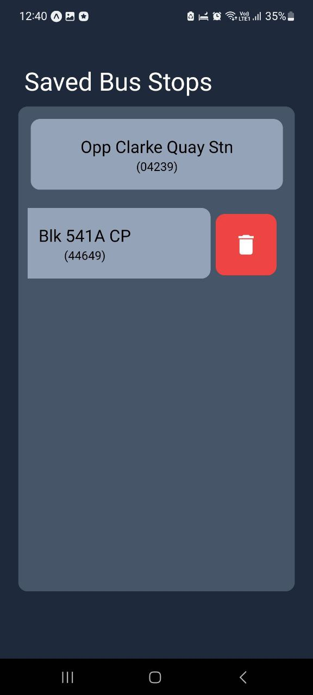

# BusBuzzin :bus:

A SG-based bus arrival mobile app with a focus on delivering push notifications for impending bus arrivals.

## Technology used

- React Native Expo implementation
- Nativewind for styling
- React Query for API fetching from [LTA](https://datamall.lta.gov.sg/content/datamall/en/dynamic-data.html)
- React Native Maps for map integration

## Feature Showcase 

### Demo

#### Basic Functionality

#### Google Maps Integration

### Gallery

#### Main Screen

#### Key UI features

  
  
  
   
  

#### Notifications

## APK Release

- v1.1.0: [APK download](https://www.dropbox.com/scl/fi/o5xuwqjcvkejuqv3aw6iz/BusBuzz_v1.1.0.apk?rlkey=xl6f1m1ondh1e5raz6swhbql5&dl=0)
- v1.2.0: [APK download](https://www.dropbox.com/scl/fi/w4jv8pv3hgnk1ybdka124/BusBuzzin_v1.2.0.apk?rlkey=5dc4w79330dqqokvig577pfij&dl=0)

## Attribution

Bus stop icon created by: <a href="https://www.flaticon.com/free-icons/bus-stop" title="bus stop icons"> mia elysia - Flaticon</a>
