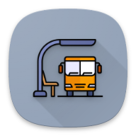
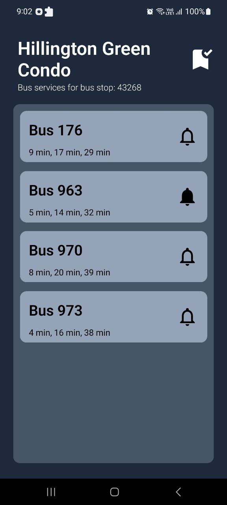

# BusBuzzin :bus:

A SG-based bus arrival mobile app with a focus on delivering push notifications for impending bus arrivals.

## Technology used

- React Native Expo implementation
- Nativewind for styling
- React Query for API fetching from [LTA](https://datamall.lta.gov.sg/content/datamall/en/dynamic-data.html)

## Feature Showcase   

### Demo

### Main Screen

### Key UI features

  
  
  

### Notifications

## APK Release

- v1.1.0: [APK download](https://www.dropbox.com/scl/fi/o5xuwqjcvkejuqv3aw6iz/BusBuzz_v1.1.0.apk?rlkey=xl6f1m1ondh1e5raz6swhbql5&dl=0)

## Attribution
<a href="https://www.flaticon.com/free-icons/bus-stop" title="bus stop icons">Bus stop icons created by mia elysia - Flaticon</a>